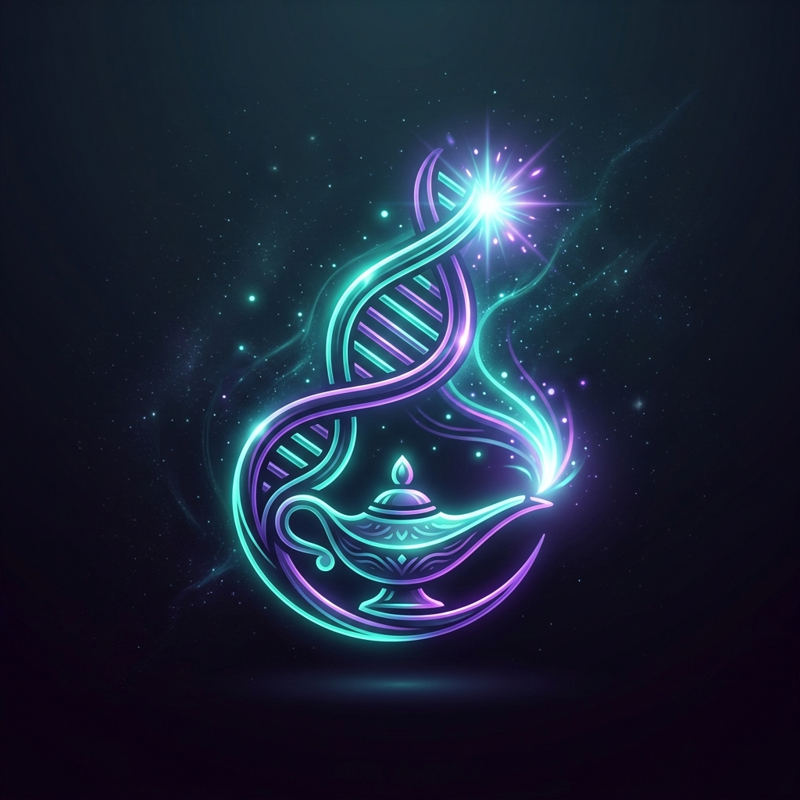
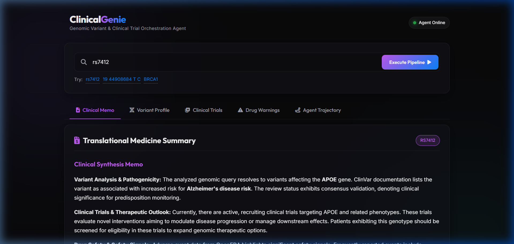

# ClinicalGenie — Genomic Variant & Clinical Trial Matching Agent

<p align="center">
  
</p>

**ClinicalGenie** is an autonomous translational genetics agent designed to help clinicians, biomedical researchers, and patients map genomic variants to pathogenicity ground-truth, biological signaling pathways, active recruiting clinical trials, and FDA pharmacovigilance safety warnings.

This project was built as a capstone submission for the **AI Agents: Intensive Vibe Coding Capstone Project** (Track: **Agents for Good**).

---

## 📸 visual Demonstration

### **A2UI Web Dashboard:**


### **Dynamic Interface Walkthrough (Animation):**


---

## 🚀 Key Features

*   **Intelligent Query Parsing**: Detects rsIDs (e.g. `rs7412`), coordinates (e.g. `19 44908684 T C`), and gene symbols (e.g. `BRCA1`).
*   **Database Orchestration**: Coordinates queries to dbSNP, ClinVar, ClinicalTrials.gov, and OpenFDA in a structured, sequential workflow.
*   **Clinical Synthesis Memo**: Harnesses Gemini to generate structured translation summaries.
*   **Glass-Box Trajectory Visualizer**: Outputs a flowchart of the agent's exact tool call execution trajectory for auditability.
*   **A2UI Dashboard**: Renders dynamic metrics, trials lists, and adverse event charts within a dark-mode glassmorphic interface.

---

## 🛠️ Tech Stack & Architecture

Following the core agent equation:
$$\mathbf{Agent = Model + Harness}$$

*   **LLM**: Gemini 1.5 Flash (via the IDE config)
*   **Backend Scaffolding**: FastAPI (Python)
*   **Dependency Management**: `uv` (PEP 723 inline script metadata for zero-setup execution)
*   **Frontend**: Vanilla HTML5, CSS custom variables (glowing glassmorphism, Outfit/Inter typography), and JavaScript (A2UI renderer)
*   **Evaluation (EDD)**: Scorecard validation runner evaluating triggering accuracy and order constraints.

---

## 📦 Directory Structure

```text
Kaggle_agentic_AI_capstone/
├── assets/                       # Visual assets (logo, screenshot, demo)
├── specs/
│   ├── clinicalgenie_spec.yaml   # API specs and validation regexes
│   └── tests.feature             # BDD (Gherkin) behavior specifications
├── eval/
│   ├── eval_cases.json           # EDD test queries and trajectories
│   └── eval_runner.py            # Glass-box scorecard runner
├── backend/
│   ├── config.py                 # Plugin and path configuration
│   ├── orchestrator.py           # Core agent pipeline orchestrator
│   └── main.py                   # FastAPI server
└── frontend/
    ├── index.html                # A2UI dashboard markup
    ├── app.css                   # Obsidian/teal glassmorphic styles
    └── app.js                    # A2UI renderer
```

---

## 💻 Quick Start & Installation

### Prerequisites
Make sure [uv](https://github.com/astral-sh/uv) is installed.

### 1. Run the Backend & Web Server
From the project root directory, run:
```bash
uv run backend/main.py
```
`uv` will automatically resolve, download, and install all required python dependencies (like `fastapi` and `uvicorn`) in a virtual environment on boot.

### 2. Access the Dashboard
Open your browser and navigate to:
```text
http://127.0.0.1:8000/
```

### 3. Run Automated Trajectory Evaluation
To trigger the EDD (Evaluation-Driven Development) test cases:
```bash
uv run eval/eval_runner.py
```
This runs the verification scorecard and outputs trajectory validation metrics to `trajectory_scorecard.md`.
